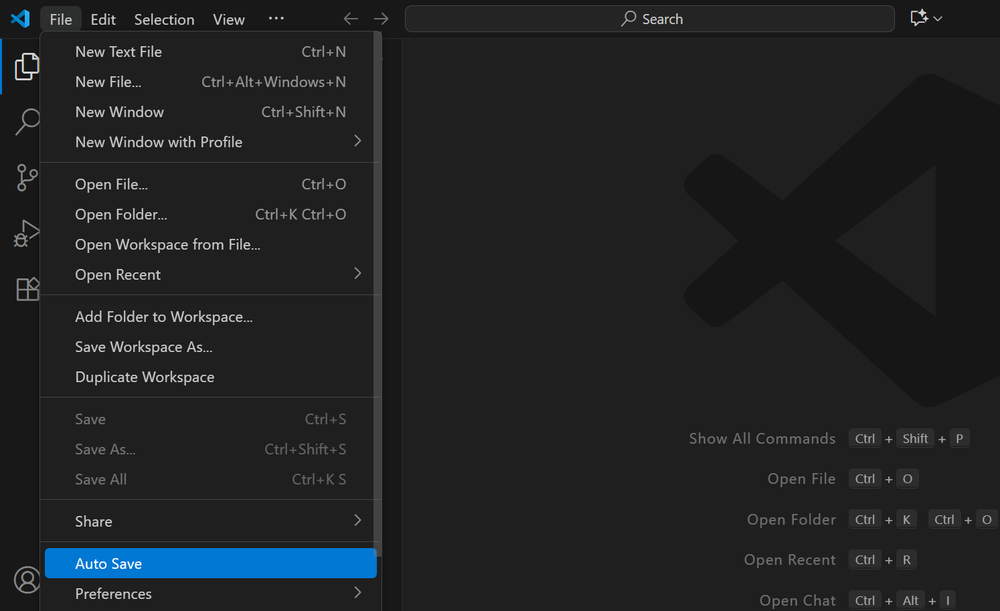

Visual Studio Code (VSCode) is a free and very popular code editor. It has a large ecosystem of extensions that can be installed to add features to your editor. These can be tools for different programming languages, tools for writing and formatting code, themes to change the appearance, and more. It's available on Windows and Mac and is pretty user-friendly.

## Getting Started

  <iframe 
    style={{position: 'absolute', top: 0, left: 0, width: '100%', height: '100%'}}
    src="https://www.youtube.com/embed/8bDBcNCngk8" 
    title="Getting Started with VSCode" 
    frameBorder="0" 
    allow="accelerometer; autoplay; clipboard-write; encrypted-media; gyroscope; picture-in-picture; web-share" 
    allowFullScreen>
  </iframe>

 and go to `File > Open Folder` in VSCode. 

## Overview

Each project in VSCode is a folder on your computer with containing all the code for your project. To start a project, all you need to do is create a new folder on your desktop. To do this from VSCode, click on `File` in the options menu in the top left corner of the editor and select `Open Folder`. This brings up file explorer where you can make and open folders on your computer.

VSCode uses a vertical sidebar with several tabs that show different features and views:
- The "Explorer" tab (files icon) shows all the files in your project. Clicking on a file in this view opens it to write in.
- The "Search" tab (magnifying glass) lets you search for text in your files
- The "Source Control" tab (branch icon) helps you use a tool called "git" to track changes to your code (optional)
- The "Extensions" tab (blocks) lets you install and manage extensions like [Live Server](https://marketplace.visualstudio.com/items?itemName=ritwickdey.LiveServer)

[Live Server](https://marketplace.visualstudio.com/items?itemName=ritwickdey.LiveServer) is the extension used to view your web pages while you code them. You can right click on a `.html` file in the explorer tab and select `Open With Live Server` at the top to open your website in your browser.

After you make changes to a file, you need to save your code with <kbd>Ctrl</kbd> + <kbd>S</kbd>. This will update your webpage being displayed with Live Server and save your changes to your computer. Alternatively, you can enable `Auto Save` to save your code automatically

